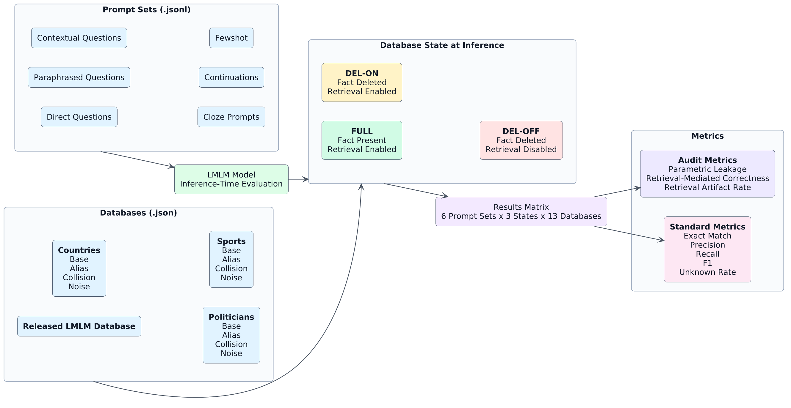
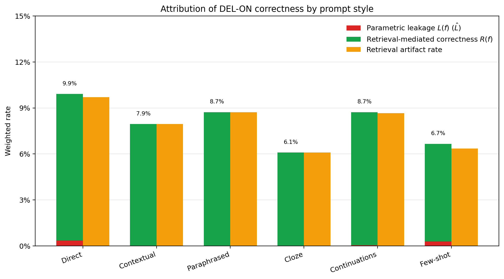
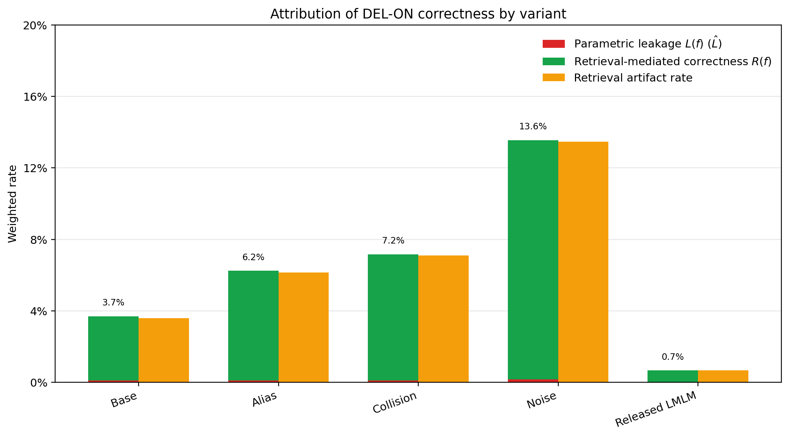
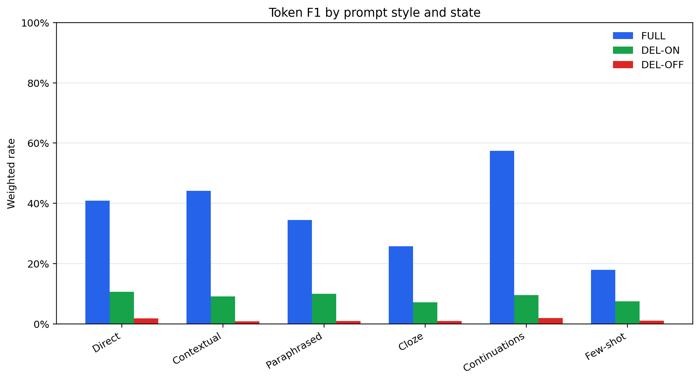

<h2 align="center">LMLM Audit: Auditing Forgetting in Limited Memory Language Models</h2>

<p align="center">
  <strong>Project repository for auditing whether factual knowledge in Limited Memory Language Models is truly externalized and removable.</strong>
</p>

<p align="center">
  Hanna Roed, Arya Raeesi<br>
  <a href="mailto:hanna.roed@berkeley.edu">hanna.roed@berkeley.edu</a>,
  <a href="mailto:aryaraeesi@berkeley.edu">aryaraeesi@berkeley.edu</a>
</p>

<p align="center">
</p>

<p align="center">
  
  
</p>

<p align="center">
  <a href="https://arxiv.org/abs/2607.00605">Final Paper</a>
  |
  <a href="https://arxiv.org/abs/2505.15962">LMLM Paper</a>
  |
  <a href="https://github.com/kilian-group/LMLM">Original LMLM Repository</a>
</p>

## Overview

Limited Memory Language Models (LMLMs) aim to separate language ability from factual knowledge by storing facts in an external database instead of only in model parameters. During pretraining, factual values are masked from the loss so the model learns when to issue structured lookups rather than memorizing every fact internally.

This repository focuses on a narrower and more diagnostic question:

**When a fact is deleted from the LMLM database, has the model actually forgotten it?**

That question is more subtle than measuring whether the model still answers correctly after deletion. A correct answer can come from at least three different sources:

- residual parametric memory
- alternative retrieval paths in the database
- approximate or semantically related retrieval matches

The goal of this project is to disentangle those mechanisms and provide a clean audit of forgetting in LMLMs.

This is an audit project built on top of the LMLM framework, not the upstream LMLM training repository itself.

## Core Idea

We evaluate each target fact under three intervention settings:

| Setting | Database state | Retrieval | What it measures |
| --- | --- | --- | --- |
| `FULL` | intact | enabled | baseline factual access |
| `DEL-ON` | target fact deleted | enabled | post-deletion behavior with retrieval still available |
| `DEL-OFF` | target fact deleted | disabled | residual parametric recall without retrieval |

This intervention set lets us ask whether post-deletion correctness comes from the model's parameters, from the external memory, or from retrieval artifacts.

We use the following quantities to decompose forgetting behavior:

- `L(f) = 1[Y(f, DEL-OFF) = o]`
  Parametric leakage: the model still produces the gold object even when retrieval is disabled.
- `R(f) = 1[Y(f, DEL-ON) = o and Y(f, DEL-OFF) != o]`
  Retrieval-mediated correctness: the model remains correct only when retrieval is enabled.
- Retrieval artifacts
  Cases where `DEL-ON` is correct even though no gold-equivalent retrieved entry appears in the inference trace.

Together, these metrics distinguish true forgetting from apparent forgetting.

## Project Goals

- Audit whether deletion-based unlearning in LMLMs removes factual access or only changes how the fact is recovered.
- Measure how often deleted facts remain accessible through internal memory alone.
- Attribute post-deletion correctness to explicit retrieved evidence versus implicit model behavior.
- Study how leakage varies across relation type, entity popularity, and prompt formulation.
- Build a reproducible evaluation framework for memory separation in modular and retrieval-augmented language models.

## Audit Pipeline

<p align="center">
  
</p>

The final paper centers on the following pipeline:

1. Draw evaluation facts directly from the released LMLM database so training, retrieval, and evaluation stay aligned.
2. Apply verified alias-closure deletion for each target fact, removing canonical and alias-equivalent realizations of `(subject, relation, object)`.
3. Run inference under `FULL`, `DEL-ON`, and `DEL-OFF`.
4. Normalize outputs against canonical entity forms so evaluation is deterministic.
5. Log retrieval traces during inference to determine whether correctness is supported by explicit database evidence.
6. Aggregate leakage, retrieval-mediated correctness, and artifact rates across fact categories.

## Running the Audit

First create the environment. This project uses [uv](https://docs.astral.sh/uv/), which resolves the dependencies (including the local `lmlm` package referenced from `../LMLM`) and builds the virtual environment in `.venv`.

```bash
uv sync
```

Then run the audit:

```bash
uv run python src/lmlm-audit/run_audit.py \
  --database-path data/custom_databases/countries/base.json \
  --prompt-files data/custom_databases/countries/prompts/base/prompts_direct_questions.jsonl \
  --max-new-tokens 12 \
  --limit 200 \
  --states FULL DEL-ON \
  --output-dir outputs/audit \
  --wandb_activation off # set up a .env file & API key for activating Weights & Biases
```

To audit the released LMLM database instead, point `--database-path` at `data/released_database/lmlm_database.json` and its sibling prompts under `data/released_database/prompts/`.

## Results

The audit pipeline produces a set of complementary measurements over the cross product of prompt style, database variant, and inference state. The figures below summarize the headline findings reported in the final paper.

The first figure decomposes DEL-ON correctness across the six prompt styles. Across every style, retrieval-mediated correctness $R(f)$ dominates while parametric leakage $L(f)$ stays close to zero, indicating that when the model still answers correctly after deletion it is almost always relying on the retrieval channel rather than residual parameter memory. The retrieval artifact rate tracks closely with retrieval-mediated correctness, which suggests that a substantial portion of post-deletion correctness is recovered without an explicit gold-equivalent retrieval entry in the trace.

<p align="center">
  
</p>

The second figure decomposes the same quantities across database variants. The Released LMLM database produces almost no DEL-ON correctness once the target fact is removed, while alias, collision, and noise variants exhibit progressively higher artifact-driven correctness. The noise variant in particular reaches roughly 13.6 percent retrieval-mediated correctness, illustrating how distractor entries can elevate apparent accuracy after deletion even when the gold fact is no longer in the database.

<p align="center">
  
</p>

Finally, token-level F1 across `FULL`, `DEL-ON`, and `DEL-OFF` makes the role of retrieval explicit. `FULL` F1 ranges from roughly 18 to 57 percent depending on prompt style, `DEL-ON` drops to single-digit territory, and `DEL-OFF` collapses to nearly zero across every prompt style. This pattern is consistent with retrieval doing the heavy lifting and the model parameters carrying very little residual factual signal once the database entry is removed.

<p align="center">
  
</p>

## Acknowledgements

We thank Akshat Gupta (Ph.D. student, UC Berkeley) for ongoing research feedback and direction; Yilun Hua (Ph.D. student, Cornell University) for further research feedback and direction on the LMLM framework; and Marcel Roed (Ph.D. student, Stanford University) for early feedback on the project proposal. This work used computing resources provided by Berkeley Research Computing through the Compton Spectrometer and Imager (COSI) mission (NASA Small Explorers (SMEX) Program).

## Citation

If you use this work, please cite:

```bibtex
@misc{lmlmauditing,
  title         = {Auditing Forgetting in Limited Memory Language Models},
  author        = {Raeesi, Arya and Roed, Hanna},
  year          = {2026},
  eprint        = {2607.00605},
  archivePrefix = {arXiv},
  primaryClass  = {cs.CL},
  url           = {https://arxiv.org/abs/2607.00605},
  doi           = {10.48550/arXiv.2607.00605}
}
```

## References

- Bourtoule, L., Chandrasekaran, V., Choquette-Choo, C. A., Jia, H., Travers, A., Zhang, B., Lie, D., and Papernot, N. Machine unlearning. In *Proceedings of the 42nd IEEE Symposium on Security and Privacy*, 2021. [arXiv:1912.03817](https://arxiv.org/abs/1912.03817).
- Carlini, N., Tramer, F., Wallace, E., Jagielski, M., Herbert-Voss, A., Lee, K., Roberts, A., Brown, T. B., Song, D., Erlingsson, Ú., Oprea, A., and Raffel, C. Extracting training data from large language models. In *USENIX Security Symposium*, 2021. [arXiv:2012.07805](https://arxiv.org/abs/2012.07805).
- Guu, K., Lee, K., Tung, Z., Pasupat, P., and Chang, M.-W. REALM: Retrieval-augmented language model pre-training. In *International Conference on Machine Learning*, 2020. [arXiv:2002.08909](https://arxiv.org/abs/2002.08909).
- Karpukhin, V., Oğuz, B., Min, S., Lewis, P., Wu, L., Edunov, S., Chen, D., and Yih, W.-t. Dense passage retrieval for open-domain question answering. In *Proceedings of the 2020 Conference on Empirical Methods in Natural Language Processing (EMNLP)*, 2020. [arXiv:2004.04906](https://arxiv.org/abs/2004.04906).
- Lewis, P., Perez, E., Piktus, A., Petroni, F., Karpukhin, V., Goyal, N., Küttler, H., Lewis, M., Yih, W.-t., Rocktäschel, T., Riedel, S., and Kiela, D. Retrieval-augmented generation for knowledge-intensive NLP tasks. In *Advances in Neural Information Processing Systems*, 2020. [arXiv:2005.11401](https://arxiv.org/abs/2005.11401).
- Lizzo, T. and Heck, L. Unlearning in LLMs: Methods, evaluation, and open challenges, 2026. [arXiv:2601.13264](https://arxiv.org/abs/2601.13264).
- Maini, P., Feng, Z., Schwarzschild, A., Lipton, Z. C., and Kolter, J. Z. TOFU: A task of fictitious unlearning for LLMs, 2024. [arXiv:2401.06121](https://arxiv.org/abs/2401.06121).
- Mallen, A., Asai, A., Zhong, V., Das, R., Khashabi, D., and Hajishirzi, H. When not to trust language models: Investigating effectiveness of parametric and non-parametric memories. In *Proceedings of the 61st Annual Meeting of the Association for Computational Linguistics (ACL)*, 2023. [arXiv:2212.10511](https://arxiv.org/abs/2212.10511).
- Meng, K., Bau, D., Andonian, A., and Belinkov, Y. Locating and editing factual associations in GPT. In *Advances in Neural Information Processing Systems*, 2022. [arXiv:2202.05262](https://arxiv.org/abs/2202.05262).
- Meng, K., Sharma, A. S., Andonian, A., Belinkov, Y., and Bau, D. Mass-editing memory in a transformer. In *International Conference on Learning Representations*, 2023. [arXiv:2210.07229](https://arxiv.org/abs/2210.07229).
- Min, S., Krishna, K., Lyu, X., Lewis, M., Yih, W.-t., Koh, P. W., Iyyer, M., Zettlemoyer, L., and Hajishirzi, H. FactScore: Fine-grained atomic evaluation of factual precision in long form text generation. In *Empirical Methods in Natural Language Processing (EMNLP)*, 2023. [arXiv:2305.14251](https://arxiv.org/abs/2305.14251).
- Yao, Y., Wang, P., Tian, B., Cheng, S., Li, Z., Deng, S., Chen, H., and Zhang, N. Editing large language models: Problems, methods, and opportunities. In *Proceedings of the 2023 Conference on Empirical Methods in Natural Language Processing (EMNLP)*, 2023. [arXiv:2305.13172](https://arxiv.org/abs/2305.13172).
- Zhao, L. and contributors. LMLM. [github.com/kilian-group/LMLM](https://github.com/kilian-group/LMLM), 2025. Commit 9be34b7.
- Zhao, L., Zalouk, S., Belardi, C. K., Lovelace, J., Zhou, J. P., Noonan, R. T., Go, D., Weinberger, K. Q., Artzi, Y., and Sun, J. J. Pre-training limited memory language models with internal and external knowledge, 2025. [arXiv:2505.15962](https://arxiv.org/abs/2505.15962).

## License

This project is licensed under the MIT License. See [LICENSE](./LICENSE) for details.
